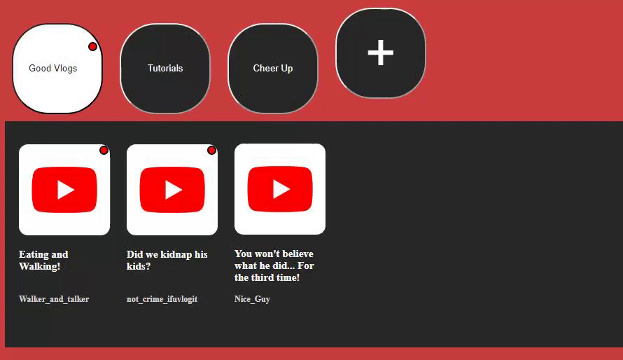

# Idea For Categories on YouTube

## **Attention: This is NOT an extension. It's an idea for YouTube and they decide if they're going to implement or not.**

## This idea is to make possible for people to organize the channels on their own way. Sometimes you just want to watch a specific theme and it's not so easy to find the channel you know you are subscribed to.

### The design is very simple because the intention was only to show the idea.

# [Code Pen](https://codepen.io/lowqualityplays/pen/OJPqwqP)

###### Leonardo Matheus